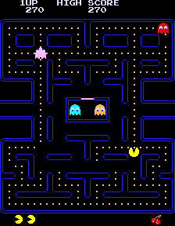

#  :notes:  Jazz dream

 
 

## Summary

- [Overview](#space_invader-overview)
- [Interaction Instructions](#video_game-interaction-instructions)
- [Animation Approach](#mag-animation-approach)
- [Technical Explanation](#wrench-technical-explanation)
- [References](#pushpin-references)

 
 

## :space_invader: Overview
> 
>  
> 
>This project merges two worlds, the **pictorial** and the **videogame** one. The starting pictorial work is ***Broadway Boogie Woogie*** (1942-43) by **Piet Mondrian**, a painting in which the author expresses the fascination and **emotions** he felt towards the jazz music he encountered in New York.
> 
>  
> 
> Observing the work, the connection with the arcade video games of the **80s** was immediate, so we tried to merge the vintage video game world with the **feelings** of the author and the idea of ​​what New York was for those who ventured there to **find fortune.**
> 
>  
> 

## :video_game: Interaction Instructions
> 
>  
> 
>Once the main screen with the name of the game is loaded **press on the screen to start the game**. 
> 
>  
> 
>To **move** Jhonny, use the **left** :arrow_left: and **right** :arrow_right: arrows on your keyboard, to jump press the **space bar.**
>
> Your mission is to collect all the **musical notes** :notes: so that Jhonny can realize his dream of becoming a Jazz musician in New York. 
>
>But watch out for the **trombones** :trumpet:, because if they hit you the world will **slow down** at 30 frames for a few seconds , and you will lose a **life** and **time**. 
>
>What are you waiting for?! Run to help Jhonny!!!
> 
>  
> 

## :mag: Animation Approach
> 
>  
> 
> - User Intercation: function mousePressed() and keyIsDown
> - The basic design, interactions, and elements within have changed completely.
> 
>  
> 

## :ghost: Techniques Used

The first time I saw the painting, the connection with Pac-man was more immediate. And after that moment I found more and more associations with different old school games, like Donkey Kong or Super Mario Bros Mini. I started by associating the colored squares of the painting with the dots that Pac-man has to eat in the game, and the larger squares with ghosts. Later I changed perspective and I arrived at the association first with Donkey Kong seeing that the larger squares reminded me of barrels and then finally I arrived at Super Mario Bros Mini, imagining the character jumping between the different levels of the painting.

 Donkey Kong

 Super Mario Bros Mini

 
 
Pac-MAn

## :wrench: Technical Explanation

  

This project in p5.js is a set of images, sounds, and dynamics that make it a real game.

 #### Mosaic Background
> The background changes depending on which stage the player is on.
>
>One of the most significant changes that can happen to the background in the game is when the player is hit by one of the enemies, activating the image that indicates a state of fear, also accentuated by the 30 frames with which the player and the enemies will move, indicating precisely the state of fear that the character is experiencing. (During all this the background will be a mosaic image.)
>
> - **Segmentation:** In setup(), the image (the main background) is divided into numSegments (currently 200) rows and columns. For each resulting small square, an ImageSegment object is created. Each ImageSegment stores its position within this grid (columnPosition, rowPosition) and, importantly, the average color of that particular segment of the original image (srcImgSegColour).
>
> - **Dynamic drawing:** Instead of drawing the entire image, the draw() function iterates through all these segments. Each segment.drawMosaicSegment() function then draws a small colored rectangle (rect()) using the stored srcImgSegColour value at the calculated position and size. This creates the mosaic effect.
>
>- **“Scary” effect:** When the player is pressed (showScaryMosaic becomes true), the code temporarily changes the source image used to determine the colors of the segments to sacry. For a short duration of SCARY_MOSAIC_DURATION, the draw() loop updates the srcImgSegColour value of each segment to match the corresponding part of the sacred image. When the timer expires, the segment colors are restored to the original image, gradually restoring the background. 
>
> 

 #### Dynamic Scaling for Responsiveness
>To adapt the game to different window sizes I used a resizing system:
>
>- **Reference Dimensions:** referenceWidth (1800) and referenceHeight (900) define the "ideal" or original size that the game was designed for.
>
> - **Scaling Factors:** In setup() and windowResized(), scaleX and scaleY are calculated by dividing the current width and height of windowWidth and windowHeight by referenceWidth and referenceHeight. This gives a ratio of how much each element should stretch or shrink horizontally and vertically.
> - **Unscaled Game Units:** All game logic, including player position (playerX, playerY), object sizes (playerWidth, platformHeight), movement speed (fallingSpeed), and enemy patrol distances, is handled using unscaled game units. This means that the internal state of the game remains consistent regardless of the window size.
>
>- **Scaled drawing and collision:** When objects are drawn using image() or text(), their unscaled positions and sizes are multiplied by scaleX and scaleY before being passed to p5.js. Collision checks (e.g. dist() for notes and enemies, or boundary checks) use the scaled positions and sizes to ensure they accurately reflect what is visible on the screen.
>
> 

 #### Player Movement and Collision

>The player's movement is handled by the gravity() and game() functions:
>
> - **Gravity and Jumping:** The gravity() function handles vertical movement. When jump is true, playerY decreases (moves up) until jumpCunter reaches jumpPower. When jump is false, playerY increases (moves down) by fallingSpeed ​​​​until it reaches minHeight (ground).
>
>- **Landing on the platform:** The game() function includes crucial logic for landing on the platform. To prevent the player from "magnetically" sticking or shaking to the platforms, it uses a variable oldPlayerY. Each frame, before gravity() updates playerY, the current value of playerY is stored in oldPlayerY.
In the platform collision check, the code checks whether the player's butt was above the highest point of the platform in oldPlayerY (oldPlayerBottom <= platformTop), but is now at or below the highest point of the platform in the current playerY (playerBottomCurrentFrame >= platformTop).
If these conditions are met and the player is not actively jumping upwards (!jump), the player has landed successfully. PlayerY is then precisely docked to the top of the platform and the jump counters (jumpCunter, jump) are reset to stop further vertical movement, ensuring a smooth landing.
>
>- **Horizontal Barriers:** The code also checks for collisions when the player hits the bottom of a platform. If detected, jumpCunter is immediately set to jumpPower and the speed is set to fallingSpeed, effectively canceling any upward movement and forcing the player to fall.
>
> 

## :pushpin: References

>These videos were very helpful in making this project:
>
> - [Jason Erdreich](#https://www.youtube.com/watch?v=FZlpuQeCvlk&list=PLBDInqUM5B26FjwMMZqGDxqQr1kX5V9Ul&index=1)
> - [Tech Head Online](#https://www.youtube.com/watch?v=enLvg0VTsAo)
>
> 